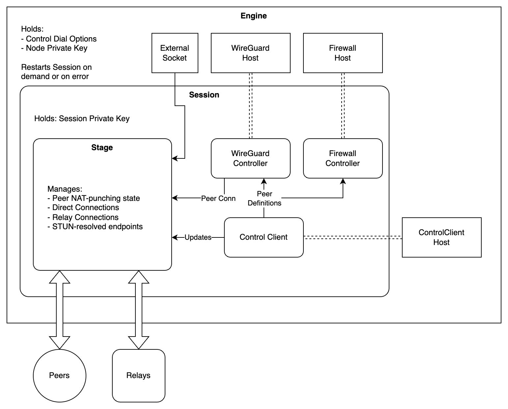
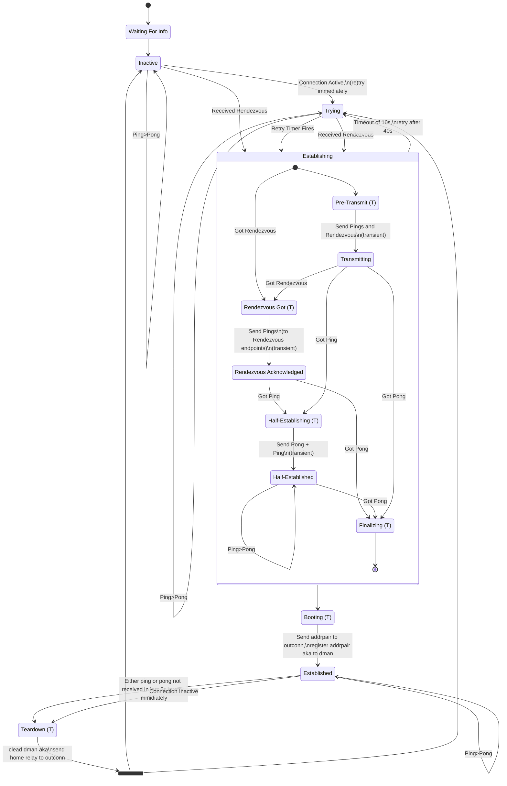

# Toversok Internal Architecture

This document lays out an internal design plan for toversok, the base library for eduP2P.

The philosophy of the library is similar to [eduvpn-common](https://github.com/eduvpn/eduvpn-common), a common-parts library for [eduVPN](https://www.eduvpn.org/), off of which individual client applications can be based.

The design idea for toversok is similar, however, with a few caveats;
- Whereas eduvpn-common provides a single wireguard/openvpn configuration, toversok would need to **dynamically change wireguard configuration**.
- Whereas eduvpn-common cares little for the way wireguard's networking would be setup, toversok has to **relay all wireguard packets**.
- Whereas eduvpn-common only needs to keep in contact with the authoritative server once at the start of the setup process, toversok needs to **keep a continuous connection to the control server for updates**.

On top of that, toversok also needs to **keep relationship status with its peers**, such as NAT-punching state and currently used keys.

## Interfaces

The external design for toversok has been reduced to its bare essentials, only requiring interface-adhering objects to be passed to the creation of an "Engine"; the runtime component of toversok.

These interfaces provide abstraction over the following "implementation details";
- WireGuard
  - Adding and removing peers
  - Statistics
  - Hijacked connection sockets per peer
- Firewall
  - Marking certain peers as "quarantined"
- Control Client
  - Sending updates to the server, such as STUN IPs
  - Receiving updates from the server, such as peer details changes

## Layers (like an onion)

As a measure to simplify internal implementation, and also to provide for robust and near-graceless restarts, there are 3 layers of internal embedding;

The Engine, the lifetime of which is controlled by the implementation embedding it into their larger program.

The Session, which encapsulates enough information to run the internals, and can be restarted wholly on demand, or on any error.

The "Stage", an internal object that manages an actor-message environment, which contain individual strongly isolated components that manage;
- Relay connections
- Direct connections
- NAT-punching state
- Wireguard synchronisation
- STUN endpoint resolution & updates to Control

### Actors

Concretely, the stage contains the following actors;
- `DirectRouter`
  - Receives Packets and routes them to;
    - If it comes from a STUN endpoint, to `EndpointManager`.
    - If it looks like a Session Message, to `SessionManager`.
    - Else, if the sending endpoint is known to represent a peer ("AKA"), towards the corresponding `InConn`.
- `DirectManager`
  - Receives write requests, writes to the raw socket.
  - Receives reads from the raw socket, forwards to `DirectRouter`.
- `RelayRouter`
  - Receives Packets and routes them to;
    - If it looks like a Session Message, to `SessionManager`.
    - Else, to a corresponding `InConn` for the sending peer ID.
- `RelayManager`
  - Holds/maintains relay connections
  - Receives write requests, writes to the corresponding relay connection
  - Receives reads from the relay connections, forwards to `RelayRouter`
- `InConn`
  - Receives packets from `Router`s, and forwards them to the wireguard connection.
  - Notes activity/inactivity on the connection, and sends this information to `TrafficManager`.
- `OutConn`
  - Receives information from `TrafficManager` on where to send packets, either;
    - Towards a specific Relay (by its ID)
    - Towards a specific IP:port pair.
  - Receives packets from the wireguard connection, and sends to;
    - `DirectManager`, if last given an IP:port pair.
    - `RelayManager`, if last given a Relay ID.
- `TrafficManager`
  - Manages NAT-punching and Peer State.
  - Triggers Peer State into an activated state once any `Conn` signals activity, and begins the NAT-punching process.
  - Depending on the current Peer State;
    - Manages `DirectRouter` AKA mapping updates. (Which IP:port pairs are associated with which peers)
    - Tells `OutConn` what relay/ip:port pair to use.
- `EndpointManager`
  - Resolves the current self public IP:port pair through STUN servers (attached to Relay servers)
    - Does this by injecting packets into `DirectRouter`, which then forwards responses back.
  - Updates the `Stage` with this information, which is then sent back to the Control Client
- `SessionManager`
  - Relays Session Messages (peer-to-peer control messages)
  - Holds the Session Private Key
  - Receives all encrypted session messages, decrypts them, and forwards to `TrafficManager`
  - Receives all plaintext session messages, encrypts them, and forwards either `RelayManager` or `DirectManager` as regular packets.

### Peer State

Inside `TrafficManager` is a finite-state-machine that tracks and controls current NAT-punching state with a peer.

This state machine responds to the following session message types;
- Ping
- Pong
- Rendezvous
  - Containing endpoints, and an implicit request to jumpstart NAT-punching

Here is an overview of the state diagram, on "Established", both peers would have a direct connection with eachother.

