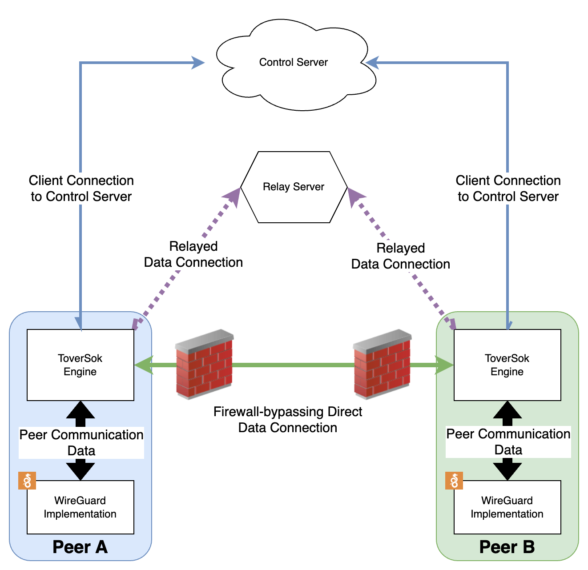

# eduP2P

An authenticated peer-to-peer network overlay.

Development notes can be found in [`DEVELOPING.md`](./DEVELOPING.md).

Library usage can be found in [`toversok/`](./toversok/README.md).

A proof-of-concept minimal implementation (wrapping the library) can be found in [`cmd/dev_client/`](cmd/dev_client/README.md).

Documentation for the test suite can be found in [`test_suite/`](./test_suite/README.md)

**eduP2P is currently in the proof-of-concept stage**, no fully fledged clients exists yet, but there is a working
terminal-based development program in `cmd/dev_client/`, as mentioned above.

Documentation on how to use the PoC (from scratch) can be found [here](./docs/trying_out_poc.md)

## Design

Toversok - the internal common-component library - provides the core of the overlay network that makes peer-to-peer connections possible.

On a high level;
- It connects to a control server, to receive peer definitions, keys, assigned IP addresses of those peers, and information about relay servers.
- On-demand, it connects to one relay server permanently, and will connect to other relay servers on-demand when sending data to their attached peers.
- It will opportunistically try to establish direct connection to peers, using relays as a fallback.

For an in-depth overview of the design, you can look at [ARCHITECTURE.md](./ARCHITECTURE.md).

## Funding

This project received funding through [NGI Assure](https://nlnet.nl/assure), a fund established by [NLnet](https://nlnet.nl) with financial support from the European Commission's [Next Generation Internet](https://ngi.eu) program. Learn more at the [NLnet project page](https://nlnet.nl/project/LetsConnect-P2P).

Furthermore, the test suite of the project received funding through NLnet's [VPN Fund](https://nlnet.nl/themes/vpn/), which is established in collaboration with [The Commons Conservancy](https://commonsconservancy.org/). A description of the test suite features made possible thanks to this funding can be found in the [test suite documentation](test_suite/README.md#funding).

