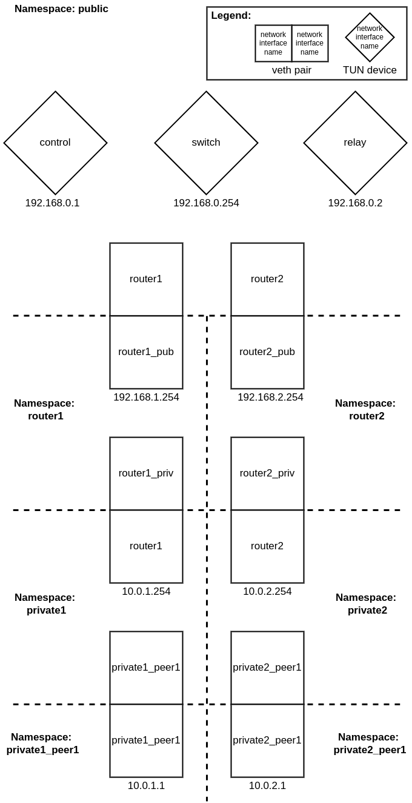
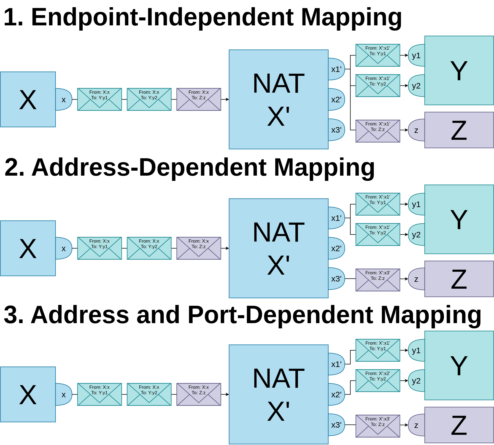
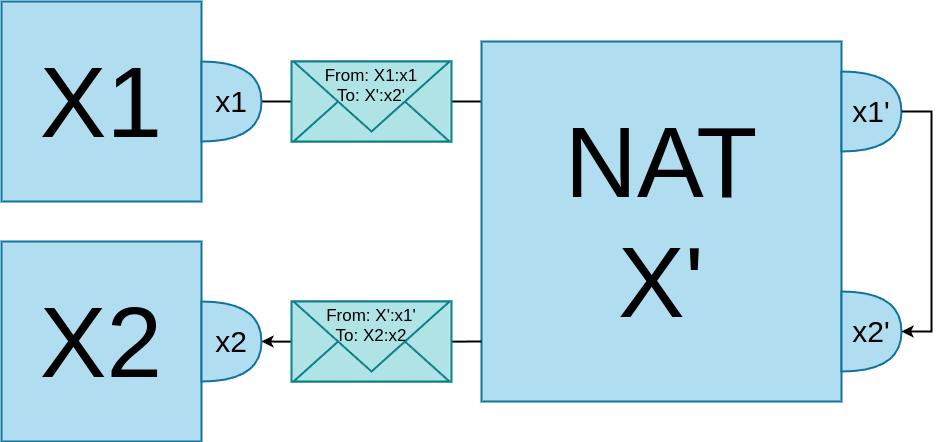

# eduP2P Test Suite

## Table of Contents

1.  [Overview](#overview)
2.  [Requirements](#requirements)
3.  [System Tests](#system-tests)
4.  [Integration Tests](#integration-tests)
5.  [Performance Tests](#performance-tests)
6.  [Test Results](#test-results)
7.  [Network Address Translation](#network-address-translation)
8.  [Bibliography](#bibliography)

## Overview

This test suite verifies whether two clients running the eduP2P
prototype can successfully establish a connection under various
conditions involving Network Address Translation (NAT). Continuous
Integration (CI) is used to automatically run the tests when the
repository is updated. CI is implemented using GitHub Workflows, and the
workflow running the tests can be found
[here](.github/workflows/go.yml).

The test suite contains three types of tests:

1.  System tests to verify the functionality of the whole system.
2.  Integration tests to verify the functionality of smaller parts of
    the system.
3.  Performance tests to measure metrics such as the delay, jitter and
    throughput of the peer-to-peer connection.

## Requirements

The full test suite is known to work on Ubuntu 22.04 and Ubuntu 24.04,
but will probably work on any GNU/Linux installation with a bash shell.
Furthermore, any machine running Go version 1.22+ should be able to run
the integration tests. The following software needs to be installed
before the full test suite can be run:

-   Go version 1.22+, which can be installed
    [here](https://go.dev/doc/install) and is necessary to build eduP2P.

### System test-specific requirements

Running the system tests requires root privileges, since network
namespaces are created to simulate isolated networks, and commands are
executed in the context of these namespaces. Therefore, the system tests
contain some commands run with sudo, and running the system tests may
result in being prompted to enter your password.

Furthermore, the system tests require a few command-line tools to be
installed. The list of tools is found in
[system\_test\_requirements.txt](system_test_requirements.txt), and can
be installed by running the following command:

    xargs -a system_test_requirements.txt sudo apt-get install

## System Tests

In these tests, two clients attempt to establish a peer-to-peer
connection using eduP2P. When these tests are executed via GitHub
workflows, the test results can be found in the output of the ‘test’ job
under the step ‘System tests’, and the logs can be downloaded using the
URL in the ‘Upload system test logs’ step. The system tests can also be
executed manually with [this script](system_tests.sh).

The system tests specifically verify whether the eduP2P peers are able
to establish a connection when NAT is involved. To do so, the local host
running the test suite must simulate a network setup where peers are
located in different private networks, and their routers which act as
the gateway to the public network apply NAT. This simulated setup is
described in the next section.

### Network Simulation Setup

The eduP2P test suite simulates the following network setup:

The setup contains two private networks, with subnets `10.0.1.0/24` and
`10.0.2.0/24` respectively, each containing one peer. The routers of the
private networks have a public and private IP. The private IP is part of
the private subnet, and its host part is `254`. The public IPs of router
1 and router 2 are `192.168.1.254` and `192.168.2.254`, respectively.
These routers apply NAT by translating the source IP of outgoing packets
from the private network to the router’s public IP, and by translating
the destination IP of incoming packets back to the corresponding private
host’s address.

There is a network switch with IP address `192.168.0.254` in between the
routers, allowing them to communicate. This network switch is also
connected to the eduP2P control server with IP address `192.168.0.1`,
and one eduP2P relay server with IP address `192.168.0.2`.

To actually simulate this setup locally on one machine, this test suite
uses Linux network namespaces [\[1\]](#ref-man_network_namespaces). For
example, in order to simulate the network setup above, multiple network
namespaces are configured as in the following diagram:

Each network namespace is isolated, meaning that a network interface in
one namespace is not aware of network interfaces in other namespaces. To
allow communication between two namespaces, some network interfaces form
virtual ethernet (veth) device pairs. Since packets on one device in
such a pair also reach the other device in the pair, they can act as
bridges between network namespaces.

There are also network interfaces that only have to communicate with
other interfaces in the same namespace. These interfaces are implemented
using TUN devices, which are virtual network devices that can handle IP
packets.

In this diagram, network namespaces are used to simulate two private
networks, each containing one peer. However, the namespaces are designed
in such a way that extra private networks, or extra peers in each
private network, can easily be added.

Below, an explanation of each namespace and the devices within them is
given. Since the namespaces on the left and right side of the diagram
are very similar, the namespaces on the right side are skipped.

-   private1\_peer1: to allow multiple peers in one private network to
    use eduP2P with userspace WireGuard, each peer needs its own network
    namespace. This is because eduP2P creates a TUN device called `ts0`
    with userspace WireGuard, and only one such device can exist per
    namespace.

    To make sure peers within a private network can still reach their
    router and each other, each peer has a veth pair. Both devices in
    the pair have the same name as the peer’s namespace, with one device
    residing in this namespace, while the other resides in the private
    network’s namespace.

-   private1: each private network needs its own namespace to properly
    isolate the private networks from the public network.

-   router1: a separate network namespace is necessary for each router
    in order for NAT to be applied in the router. This test suite uses
    nftables [\[2\]](#ref-man_nft) to apply NAT, and in this framework
    NAT is only applied to the source IP of packets if these packets are
    leaving the local machine. The network interface `router1_pub` that
    applies NAT is in its own namespace, so that both packets going to
    the private network and to the public network look as if they are
    leaving the local machine, and hence have NAT applied to them.

    To allow the router to communicate with the public network,
    `router1_pub` forms a veth pair with the `router1` device in the
    public network. Similarly, to allow the router to communicate with
    the private network, there is a veth pair consisting of the devices
    `router1_priv` in the router’s namespace, and `router1` in the
    private network’s namespace.

-   public: this network namespace exists to isolate the whole network
    setup from the machine’s root network namespace, such that the only
    traffic flowing through the namespaces is traffic concerning eduP2P.
    Besides a veth device for each router, this namespace also contains
    a TUN device that acts as a network switch between the routers, and
    TUN devices to simulate the control and relay server of eduP2P.

This network setup allows eduP2P to be tested under the following
conditions: - Two peers in different private networks behind NAT
devices. - Two peers in the same private network behind the same NAT
device. - One or two peers in the public network. The network setup
allows public “peers” to be simulated by making a router act as a peer,
since the routers have a public IP address.

The next section explains the types of NAT in this network setup, and
describes how they are implemented.

### Applying NAT

To categorize different types of NAT, this test suite follows the
terminology of RFC 4787 [\[3\]](#ref-rfc4787). This RFC outlines various
NAT behaviours, of which the following are implemented in the test
suite: mappings behaviours, filtering behaviours and hairpinning.

#### Mapping behaviours

When an internal endpoint behind a NAT initiates a connection by sending
a packet to an external endpoint outside its private network, the NAT
must keep track of this connection between the two endpoints, called a
session, in order to properly translate the source address of packets
sent by the internal endpoint, and the destination address of packets
sent to the internal endpoint. This session is a tuple consisting of the
IP addresses and ports of the internal endpoint and the IP address and
port of the external endpoint.

A NAT’s mapping behaviour dictates how mappings are reused when there
are multiple sessions to different endpoints. We assume there already is
a session between an internal endpoint with IP address `X` and port `x`,
and an external endpoint with IP address `Y` and port `y1`, i.e., a
session `(X:x, Y:y1)`, where `X:x` is mapped to `X':x1'`. RFC 4787
describes three types of behaviour:

1.  **Endpoint-Independent Mapping (EIM):** the mapping is only reused
    for later packets from `X:x` to any external endpoint.
2.  **Address-Dependent Mapping (ADM):** the mapping is only reused for
    later packets from `X:x` to any external endpoint with IP address
    `Y`.
3.  **Address and Port-Dependent Mapping (ADPM):** the mapping is only
    reused for later packets from `X:x` to the same external endpoint
    `Y:y1`.

The image below illustrates the difference between the three mapping
behaviours. It shows the internal endpoint `X:x` sending a packet to the
external endpoint `Y:y1` to create the initial mapping, and how the
reuse of this mapping by other sessions differs between the three types
of behaviours.

Note that in this test suite, the NAT’s IP pooling behaviour is not
considered, as the routers in the simulated network setup only have one
IP address.

The test suite implements these three behaviours by using the nftables
framework [\[2\]](#ref-man_nft) in the routers’ namespaces. For each of
the three mapping behaviours, separate rules have to be applied in the
`nat` table’s `postrouting` chain:

1.  **EIM:** A rule is applied to all packets going to the public
    network with a source address from the private network. The target
    of this rule is `masquerade`, with the `persistent` option.
    `masquerade` is a form of Source NAT where the source IP is
    automatically translated to the IP of the outgoing network
    interface, which in this case is the router’s public IP address.
    With the `persistent` option, the same mapping is reused for each
    different endpoint.

    The mappings created with this rule are also automatically used to
    translate the destination IP of packets entering private network,
    since the Linux kernel’s conntrack module
    [\[4\]](#ref-man_conntrack) keeps track of the sessions using these
    mappings.

2.  **ADM:** To simulate this type of mapping behaviour, multiple copies
    of the rule for EIM are used, but each rule only applies to a single
    destination IP address, and translates the source port to a unique
    range of 100 ports. This method of simulating ADM is feasible in the
    test suite, since the possible IP addresses a host can communicate
    with are limited and known beforehand.

3.  **ADPM:** For this mapping behaviour, only one rule has to be
    applied again. The rule is identical to that for EIM, except that
    the `random` option is used with the `masquerade` target instead of
    the `persistent` option. With the `random` option, a random port is
    selected for each different endpoint.

The exact syntax of the rules can be found in [the script applying the
NAT mapping rules](nat_simulation/setup_nat_mapping.sh).

#### Filtering behaviours

We again assume the mapping from `X:x` to `X':x1'` created for the
session `(X:x, Y:y1)`. A NAT’s filtering behaviour dictates which
incoming packets destined to `X':x1'` are filtered, instead of being
translated and sent to `X:x`. Just like for mapping, RFC 4787 describes
three different types of behaviour with the same naming convention:

1.  **Endpoint-Independent Filtering (EIF):** packets destined to `X:x`
    are never filtered, regardless of their source IP address or port.
2.  **Address-Dependent Filtering (ADF):** packets destined to `X:x` are
    filtered only if their source IP address does not equal `Y`
3.  **Address and Port-Dependent Filtering (ADPF):** packets destined to
    `X:x` are filtered only if their source endpoint does not equal
    `Y:y1`.

The image below illustrates the difference between the three filtering
behaviours. It shows the internal endpoint `X:x` again sending a packet
to the external endpoint `Y:y1` to create the initial mapping, then it
shows packets sent back to `X':x1'` from various endpoints. Some of
these packets may be filtered, which is indicated by a dashed arrow.

Packets destined to an IP address and port for which a mapping does not
exist are also filtered, which the test suite implements using one
nftables rule in the `filter` table’s `input` chain that applies to all
packets, and accepts those that belong to an existing session. The
`input` chain’s default policy is set to drop, which means packets that
do not belong to an existing session are filtered.

Each time an internal endpoint establishes a connection to a new
external endpoint, a new session is also created. Therefore, the above
nftables rule is sufficient to simulate ADPF, since only the original
session’s endpoint can send packets to the corresponding mapped IP
address.

For the other two filtering behaviours, this rule is too restrictive,
and they require adding a `prerouting` chain to the `nat` table. In this
chain, destination NAT is performed on the packets that should not be
filtered, so that they do not flow through the `input` chain and are
instead forwarded to the internal endpoint they are destined for. To
perform such destination NAT, a rule must be applied for each new
session. To create these rules, the new sessions are monitored and the
necessary information is parsed from them in order to dynamically add a
new rule. Suppose a new session `(X:x, Y:y)` is created, where `X:x` is
mapped to `X':x'`. For such a session, the destination NAT rule would
look as follows:

1.  **EIF:** the rule applies to any packet destined to `X':x'`, and
    changes the destination to `X:x`.
2.  **ADF:** the rule applies to any packet destined to `X':x'`
    originating from source IP `Y`, and changes the destination to
    `X:x`.

The exact syntax of the rules can be found in [the script applying the
NAT filtering rules](nat_simulation/setup_nat_filtering_hairpinning.sh).

#### Hairpinning

NATs that support hairpinning allow endpoints behind the same NAT to
communicate via their translated IP addresses and ports. For example,
suppose there are two endpoints `X1:x1` and `X2:x2` behind the same
hairpinning NAT, which maps `X1:x1` to `X':x1'` and `X2:x2` to `X':x2'`.
Then, if `X1:x1` sends a packet to `X':x2'`, the NAT will route this
packet to `X2:x2`. RFC 4797 describes two types of hairpinning
behaviours:

1.  **Internal source IP address and port:** in the example above, the
    packet that arrives at `X2:x2` has `X1:x1` as source, i.e., the
    source is not changed.
2.  **External source IP address and port:** in the example above, the
    packet that arrives at `X2:x2` has `X':x1'` as source, i.e., the
    source address and port are mapped to their external counterparts.

The image below illustrates the second type of behaviour, which is the
one recommended by RFC 4787 and implemented in the test suite.

The way hairpinning is implemented in the test suite is similar to the
implementation of filtering. For a new session where `X1:x1` is mapped
to `X':x1'`, two nftables rules are dynamically added:

1.  The first rule is in the `nat` table’s `prerouting` chain, and is
    necessary to “hairpin” packets *destined to* `X':x1'`. It applies to
    all packets from the private network destined to `X':x1'`, and uses
    destination NAT to change the destination endpoint to `X1:x1`.
2.  The second rule is in the `nat` table’s `postrouting` chain, and is
    necessary to simulate External source IP address and port
    hairpinning behaviour for hairpinned packets *originating from*
    `X1:x1`. It applies to all packets from `X1:x1` destined to the
    private network, and uses source NAT to change the source endpoint
    to `X1':x1'`.

The exact syntax of the rules can be found in [the script applying the
NAT hairpinning
rules](nat_simulation/setup_nat_filtering_hairpinning.sh), which is the
same script that was used for applying filtering.

## Integration Tests

In these tests, the smaller components of the eduP2P client are tested,
such as the lower layers described in [the document describing eduP2P’s
architecture](../ARCHITECTURE.md):

-   The Session
-   Some of the separate Stages:
    -   TODO decide which, if not all

Furthermore, the control server and relay server are also tested.

The tests can be executed manually by running `go test ./test_suite/...`
from the repository’s root directory.

## Performance Tests

TODO

## Test Results

TODO

## Bibliography

\[1\]
“network\_namespaces -
overview of Linux network namespaces.” in
Linux Programmer’s Manual. Michael Kerrisk.
Available:
<https://man7.org/linux/man-pages/man7/network_namespaces.7.html>

\[2\]
P. McHardy and P. N. Ayuso,
“nft - Administration tool of the nftables
framework for packet filtering and classification.” Available:
<https://www.netfilter.org/projects/nftables/manpage.html>

\[3\]
C. F. Jennings and F. Audet,
“Network Address Translation (NAT) Behavioral
Requirements for Unicast UDP.” in Request for comments. RFC 4787;
RFC Editor, Jan. 2007. doi:
[10.17487/RFC4787](https://doi.org/10.17487/RFC4787).

\[4\]
H. Welte,
“conntrack - command line interface for netfilter
connection tracking.” Available:
<https://manpages.debian.org/jessie/conntrack/conntrack.8.en.html>
