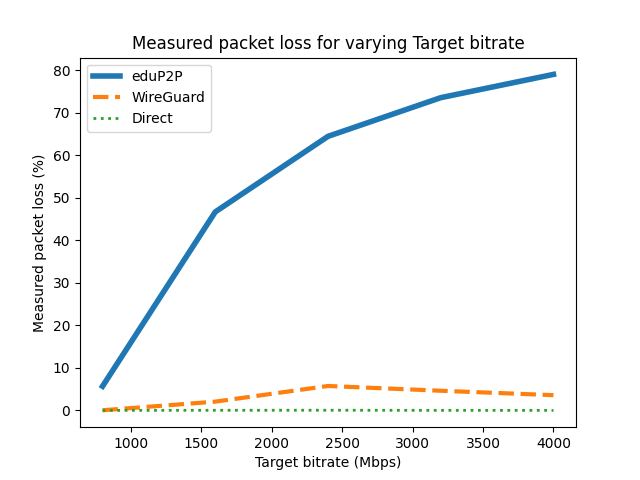

# eduP2P Test Suite

A CI test suite for the eduP2P prototype.

## Table of Contents

1.  [Overview](#overview)
    1.  [Requirements](#requirements)
    2.  [System Tests](#system-tests)
    3.  [Performance Tests](#performance-tests)
    4.  [Integration Tests](#integration-tests)
2.  [Results](#results)
    1.  [System Test Results](#system-test-results)
    2.  [Performance Test Results](#performance-test-results)
    3.  [Integration Test Results](#integration-test-results)
3.  [Bibliography](#bibliography)
4.  [Funding](#funding)

# Overview

This test suite verifies whether two clients running the eduP2P
prototype can successfully establish a connection under various
conditions involving Network Address Translation (NAT). Continuous
Integration (CI) is used to automatically run the tests when the
repository is updated. CI is implemented using GitHub Workflows, and the
workflow running the tests can be found
[here](../.github/workflows/CI_test_suite.yml).

The test suite contains three types of tests:

1.  System tests to verify the functionality of the whole system.
2.  Performance tests to measure metrics such as the delay, jitter and
    throughput of the peer-to-peer connection.
3.  Integration tests to verify the functionality of smaller parts of
    the system.

These three types of tests, and their results, are described in more
detail later in this document.

## Requirements

The full test suite is known to work on Ubuntu 22.04 and Ubuntu 24.04,
but will probably work on any GNU/Linux installation with a bash shell.
The only requirement common to all three types of tests is Go version
1.22+, which can be installed [here](https://go.dev/doc/install) and is
necessary to build eduP2P. This is also the only requirement for the
test suite’s integration tests. The additional requirements to run the
system and performance tests are listed in the next two subsections.

### System test-specific requirements

Running the system tests requires root privileges in order to execute
commands in the context of network namespaces created during the system
tests. Therefore, the system tests contain some commands run with sudo,
and running the system tests may result in being prompted to enter your
password.

Furthermore, the system tests require a few command-line tools to be
installed. The list of tools is found in
[system_test_requirements.txt](system_test_requirements.txt), and can be
installed by running the following command (which itself requires the
sudo and xargs packages):

    xargs -a system_test_requirements.txt sudo apt-get install

### Performance test-specific requirements

The performance tests are run as a part of the system tests, and require
a Python script to visualize the results. The dependencies of this
Python script are listed in
[python_requirements.txt](python_requirements.txt), and can be installed
as follows:

    pip install -r python_requirements.txt

## System Tests

In these tests, two clients attempt to establish a peer-to-peer
connection using eduP2P. When these tests are executed via GitHub
workflows, the test results can be found in the output of the
“SystemTests” job under the step “Run system tests”, and the logs can be
downloaded using the URL in the “Upload system test logs” step.

The system tests can also be executed manually using
[system_tests.sh](system_tests.sh). For example, the command below
executes connectivity tests, where the simulated packet loss is set to
2.5%. The script also generates logs, including the logs of the two
eduP2P peers. The eduP2P client has multiple log levels, and in this
command the ‘debug’ level is specified.

    ./system_tests.sh -c 2.5 -l debug

The system tests specifically verify whether the eduP2P peers are able
to establish a connection when NAT is involved. To do so, the machine
running the test suite must simulate a network setup where peers are
located in different private networks, and their routers which act as
the gateway to the public network apply NAT.

The test suite uses a simulated setup of multiple networks instead of a
physical setup for two reasons:

1.  The simulated setup can be run on a single machine, therefore making
    the test suite easier to use.
2.  A simulated setup acts as a more ideal environment to perform the
    tests, since it is affected less by throughput limitations or
    network congestion than a physical network.

The simulated network setup is described in detail in the next section.

### Network Simulation Setup

The eduP2P test suite simulates the network setup illustrated in the
image below:


The setup contains two private networks, with subnets `10.0.1.0/24` and
`10.0.2.0/24` respectively. In the test suite, each private network
contains two hosts. In the diagram, only one host is shown per private
network for the sake of simplicity. The routers of the private networks
have a public and private IP. The private IP is part of the private
subnet, and its host part is `254`. The public IPs of router 1 and
router 2 are `192.168.1.254` and `192.168.2.254`, respectively. These
routers apply NAT by translating the source IP of outgoing packets from
the private network to the router’s public IP, and by translating the
destination IP of incoming packets back to the corresponding private
host’s address.

There is a network switch with IP address `192.168.0.254` in between the
routers, allowing them to communicate. This network switch is also
connected to the eduP2P control server with IP address `192.168.0.1`,
and one eduP2P relay server with IP address `192.168.0.2`.

To actually simulate this setup locally on one machine, this test suite
uses Linux network namespaces [\[1\]](#ref-man_network_namespaces). For
example, in order to simulate the network setup above, multiple network
namespaces are configured as in the following diagram:


Each network namespace is isolated, meaning that a network interface in
one namespace is not aware of network interfaces in other namespaces. To
allow communication between two namespaces, some network interfaces form
virtual ethernet (veth) device pairs [\[2\]](#ref-man_veth), with each
device in a different network namespace. Since packets on one device in
such a pair also reach the other device in the pair, they can act as
bridges between network namespaces.

There are also network interfaces that only have to communicate with
other interfaces in the same namespace. These interfaces are implemented
using TUN devices, which are virtual network devices that can handle IP
packets.

In this diagram, network namespaces are used to simulate two private
networks, each containing one peer. However, the namespaces are designed
in such a way that extra private networks, or extra peers in each
private network, can easily be added.

Below, an explanation of each namespace and the devices within them is
given. Since the namespaces on the left and right side of the diagram
are very similar, the namespaces on the right side are skipped.

- **private1_peer1:** to allow multiple peers in one private network to
  use eduP2P with userspace WireGuard, each peer needs its own network
  namespace. This is because eduP2P creates a TUN device called `ts0`
  with userspace WireGuard, and only one such device can exist per
  namespace.

  To make sure peers within a private network can still reach their
  router, each peer has a veth pair. Both devices in the pair have the
  same name as the peer’s namespace, with one device residing in this
  namespace, while the other resides in the private network’s namespace.

- **private1:** each private network needs its own namespace to properly
  isolate the private networks from the public network.

- **router1:** a separate network namespace is necessary for each router
  in order for NAT to be applied in the router. This test suite uses
  nftables [\[3\]](#ref-man_nft) to apply NAT, and in this framework NAT
  is only applied to packets that are leaving the local machine. The
  network interface `router1_pub` that applies NAT is in its own
  namespace, so that both packets going to the private network and to
  the public network look as if they are leaving the local machine, and
  hence have NAT applied to them.

  To allow the router to communicate with the public network,
  `router1_pub` forms a veth pair with the `router1` device in the
  public network. Similarly, to allow the router to communicate with the
  private network, there is a veth pair consisting of the devices
  `router1_priv` in the router’s namespace, and `router1` in the private
  network’s namespace.

- **public:** this network namespace exists to isolate the whole network
  setup from the machine’s root network namespace, such that the only
  traffic flowing through the namespaces is traffic generated by the
  test suite. This namespace also contains a TUN device that acts as a
  network switch between the routers and the eduP2P control and relay
  servers.

- **control:** the goal of this namespace is to force all outgoing
  traffic from the control server to be routed via the switch. If the
  control server would reside in the public namespace, it could
  communicate with the routers directly. The reason all traffic should
  be routed via the switch is so that packet loss, which is a
  configurable option in the system tests, can be easily simulated on
  one central interface.

This network setup allows eduP2P to be tested under the following
conditions:

- Two peers in different private networks behind NAT devices.
- Two peers in the same private network behind the same NAT device.
- One or two peers in the public network. The network setup allows
  public “peers” to be simulated by making a router act as a peer, since
  the routers have a public IP address.

The next section explains the types of NAT in this network setup, and
describes how they are implemented.

### Applying NAT

To categorize different types of NAT, this test suite follows the
terminology of RFC 4787 [\[4\]](#ref-rfc4787). This RFC outlines various
NAT behaviours, of which the following are implemented in the test
suite: mapping behaviours, filtering behaviours and hairpinning.

#### Mapping behaviours

When an internal endpoint behind a NAT initiates a connection by sending
a packet to an external endpoint outside its private network, the NAT
must keep track of this connection between the two endpoints, called a
session, in order to properly translate the source address of outgoing
packets sent by the internal endpoint, and the destination address of
incoming packets sent to the internal endpoint. This session is a tuple
consisting of the IP addresses and ports of both the internal and
external endpoint. In order for NAT to be applied consistently within a
session, each session is mapped to a IP address and port on the NAT
device itself, which is used to translate the source of outgoing packets
and thedestination of incoming packets.

A NAT’s mapping behaviour dictates how mappings are reused when there
are multiple sessions to different endpoints. We assume there already is
a session between an internal endpoint with IP address `X` and port `x`,
and an external endpoint with IP address `Y` and port `y1`, i.e., a
session `(X:x, Y:y1)`, where `X:x` is mapped to `X':x1'`. RFC 4787
describes three types of behaviour:

1.  **Endpoint-Independent Mapping (EIM):** the mapping is only reused
    for later packets from `X:x` to any external endpoint.
2.  **Address-Dependent Mapping (ADM):** the mapping is only reused for
    later packets from `X:x` to any external endpoint with IP address
    `Y`.
3.  **Address and Port-Dependent Mapping (ADPM):** the mapping is only
    reused for later packets from `X:x` to the same external endpoint
    `Y:y1`.

The image below illustrates the difference between the three mapping
behaviours. It shows the internal endpoint `X:x` sending a packet to the
external endpoint `Y:y1` to create the initial mapping, and how the
reuse of this mapping by other sessions differs between the three types
of behaviours:

1.  **EIM:** The mapping is reused for both the packet destined to
    `Y:y2` and the packet destined to `Z:z`, since this mapping
    behaviour reuses a mapping for all endpoints.
2.  **ADM:** The mapping is reused for the packet destined to `Y:y2`,
    since its destination IP is equal to the one of the session the
    mapping was created for. However, the packet destined to `Z:z` uses
    a new mapping, since it has a different destination IP.
3.  **ADPM:** A new mapping is used for each packet, since all packets
    have different endpoints.


Note that in this test suite, the NAT’s IP pooling behaviour is not
considered, as the routers in the simulated network setup only have one
IP address. Therefore, the only difference between mappings is their
ports.

The test suite implements the above three behaviours by using the
nftables framework [\[3\]](#ref-man_nft) in the routers’ namespaces. For
each of the three mapping behaviours, separate rules have to be applied
in the `nat` table’s `postrouting` chain:

1.  **EIM:** A rule is applied to all packets going to the public
    network with a source address from the private network. The target
    of this rule is `masquerade`, with the `persistent` option.
    `masquerade` is a form of Source NAT where the source IP is
    automatically translated to the IP of the outgoing network
    interface, which in this case is the router’s public IP address.
    With the `persistent` option, the same mapping is reused for each
    different endpoint.

    The mappings created with this rule are also automatically used to
    translate the destination IP of packets going to the private
    network, since the Linux kernel’s conntrack module
    [\[5\]](#ref-man_conntrack) keeps track of the sessions using these
    mappings.

2.  **ADM:** To simulate this type of mapping behaviour, multiple copies
    of the rule for EIM are used, but each rule only applies to a single
    destination IP address, and translates the source port to a unique
    range of 100 ports. This method of simulating ADM is feasible in the
    test suite, since the possible IP addresses a host can communicate
    with are limited and known beforehand.

3.  **ADPM:** For this mapping behaviour, only one rule has to be
    applied again. The rule is identical to that for EIM, except that
    the `random` option is used with the `masquerade` target instead of
    the `persistent` option. With the `random` option, a random port is
    selected for each different endpoint.

The exact syntax of the rules can be found in [the script applying the
NAT mapping rules](nat_simulation/setup_nat_mapping.sh).

#### Filtering behaviours

We again assume the mapping from `X:x` to `X':x1'` created for the
session `(X:x, Y:y1)`. A NAT’s filtering behaviour dictates which
incoming packets destined to `X':x1'` are filtered, instead of being
translated and sent to `X:x`. Just like for mapping, RFC 4787 describes
three different types of behaviour with the same naming convention:

1.  **Endpoint-Independent Filtering (EIF):** packets destined to
    `X':x1'` are never filtered, regardless of their source IP address
    or port.
2.  **Address-Dependent Filtering (ADF):** packets destined to `X':x1'`
    are filtered only if their source IP address does not equal `Y`
3.  **Address and Port-Dependent Filtering (ADPF):** packets destined to
    `X':x1'` are filtered only if their source endpoint does not equal
    `Y:y1`.

The image below illustrates the difference between the three filtering
behaviours. It shows the internal endpoint `X:x` again sending a packet
to the external endpoint `Y:y1` to create the initial mapping, then it
shows packets sent back to `X':x1'` from various endpoints. Some of
these packets may be filtered, which is indicated by a dashed arrow:

1.  **EIF:** None of the packets are filtered, since they are all
    destined to a port on the NAT for which a mapping exists.
2.  **ADF:** The packet from `Z:z` is filtered, because incoming packets
    to `X':x1'` are only accepted if they have source IP address `Y`.
3.  **ADPF:** The packets from `Y:y2` and `Z:z` are filtered, because
    incoming packets to `X':x1'` are only accepted if they have source
    IP address `Y` and source port `y1`.


Packets destined to an IP address and port for which a mapping does not
exist are also filtered, which the test suite implements using one
nftables rule in the `filter` table’s `input` chain that applies to all
packets, and only accepts those that belong to an existing session. The
`input` chain’s default policy is set to drop, which means packets that
do not belong to an existing session are filtered.

Each time an internal endpoint establishes a connection to a new
external endpoint, a new session is also created. Therefore, the above
nftables rule is sufficient to simulate ADPF, since only the original
session’s endpoint can send packets to the corresponding mapped IP
address.

For the other two filtering behaviours, this rule is too restrictive,
and they require adding a `prerouting` chain to the `nat` table. In this
chain, destination NAT is performed on the packets that should not be
filtered, so that they do not flow through the `input` chain and are
instead forwarded to the internal endpoint they are destined for. To
perform such destination NAT, a rule must be applied for each new
session. To create these rules, the new sessions are monitored and the
necessary information is parsed from them in order to dynamically add a
new rule. Suppose a new session `(X:x, Y:y)` is created, where `X:x` is
mapped to `X':x'`. For such a session, the destination NAT rule would
look as follows:

1.  **EIF:** the rule applies to any packet destined to `X':x'`, and
    changes the destination to `X:x`.
2.  **ADF:** the rule applies to any packet destined to `X':x'`
    originating from source IP `Y`, and changes the destination to
    `X:x`.

The exact syntax of the rules can be found in [the script applying the
NAT filtering rules](nat_simulation/setup_nat_filtering_hairpinning.sh).

#### Hairpinning

NATs that support hairpinning allow endpoints behind the same NAT to
communicate via their translated IP addresses and ports. For example,
suppose there are two endpoints `X1:x1` and `X2:x2` behind the same
hairpinning NAT, which maps `X1:x1` to `X':x1'` and `X2:x2` to `X':x2'`.
Then, if `X1:x1` sends a packet to `X':x2'`, the NAT will route this
packet to `X2:x2`. RFC 4797 describes two types of hairpinning
behaviours:

1.  **Internal source IP address and port:** in the example above, the
    packet that arrives at `X2:x2` has `X1:x1` as source, i.e., the
    source is not changed.
2.  **External source IP address and port:** in the example above, the
    packet that arrives at `X2:x2` has `X':x1'` as source, i.e., the
    source address and port are mapped to their external counterparts.

The image below illustrates the second type of behaviour, which is the
one recommended by RFC 4787 and implemented in the test suite.


The way hairpinning is implemented in the test suite is similar to the
implementation of filtering. For a new session where `X1:x1` is mapped
to `X':x1'`, two nftables rules are dynamically added:

1.  The first rule is in the `nat` table’s `prerouting` chain, and is
    necessary to “hairpin” packets *destined to* `X':x1'`. It applies to
    all packets from the private network destined to `X':x1'`, and uses
    destination NAT to change the destination endpoint to `X1:x1`.
2.  The second rule is in the `nat` table’s `postrouting` chain, and is
    necessary to simulate External source IP address and port
    hairpinning behaviour for hairpinned packets *originating from*
    `X1:x1`. It applies to all packets from `X1:x1` destined to the
    private network, and uses source NAT to change the source endpoint
    to `X1':x1'`.

The exact syntax of the rules can be found in [the script applying the
NAT hairpinning
rules](nat_simulation/setup_nat_filtering_hairpinning.sh), which is the
same script that was used for applying filtering.

## Performance Tests

The test suite contains performance tests to measure the bitrate, jitter
and packet loss of a connection between two peers. These tests are
implemented using the iperf3 tool [\[6\]](#ref-man_iperf3).
Additionally, the delay of the connection is also measured by setting up
an HTTP server on one peer, repeatedly connecting to this server from
the other peer with the curl tool [\[7\]](#ref-man_curl), and
calculating the average connection time.

To test the performance of eduP2P, a connection between two peers must
first be established. Therefore, the performance tests are implemented
as an optional part of the system tests. For each system test,
performance tests may be run after a connection has been established by
configuring the following parameters:

- **Independent variable**: the user can choose an independent variable
  during the performance tests. This variable will take different values
  that are also configured by the user, and the performance test will be
  performed for each value. This way, it is possible to measure the
  effect of the independent variable on the performance of eduP2P.
  Currently, the test suite implements the following independent
  variables:

  1.  Packet loss: the percentage of packets that should be dropped
      during the performance test.
  2.  Bitrate: the speed at which iperf3 should try to send packets
      during the performance test (in Mbps).
  3.  One-way delay: the amount of milliseconds that the sending of a
      packet should be postponed (implemented using the netem tool
      [\[8\]](#ref-man_netem)).

- **Performance test baseline**: with this optional parameter, a
  ‘baseline’ is added to the performance test results, created by
  repeating the performance tests for:

  1.  two peers that use WireGuard;
  2.  two peers that use their physical IP addresses in the simulated
      network setup.

  With this baseline, it is easier to investigate whether any
  performance deficiencies in eduP2P are truly the result of a problem
  in eduP2P, or are instead caused by WireGuard (which is used
  internally in eduP2P), or by a limitation of the test suite’s
  simulated network setup.

- **Performance test duration**: this parameter determines how long each
  performance test should run for. For one system test, the total amount
  of time the performance tests take is this parameter multiplied by the
  amount of values assigned to the independent variable. If the baseline
  parameter is used, the duration is additionally multiplied by 3.

To run performance tests manually, [system_tests.sh](system_tests.sh)
can be used with the `-f` option to specify a file containing system
tests, which may use the above parameters to also execute a performance
test after a successful system test.

The following command runs tests from a file named
`performance_test.txt`:

    ./system_tests.sh -f performance_test.txt

Suppose `performance_test.txt` contains the following line:

    run_system_test -k bitrate -v 100,200 -d 5 TS_PASS_DIRECT router1-router2 : :

Then, running the system tests with the `-f performance_test.txt` option
will execute a performance test with the following parameters:

- the independent variable to be tested is bitrate;
- the values it should take are 100 and 200 Mbps;
- the duration of the test for each value is 5 seconds.

The other parameters in `performance_test.txt` are not relevant to the
performance test itself, but are necessary to run the system test in the
first place. Internally, these parameters are passed to the
[system_test.sh](system_test.sh) script. This script, like all other
bash scripts in this repository, has a usage specification at the top of
the script. For this script, the specification is also printed when
running `./system_test.sh -h` (this is also the case for some other bash
scripts, but not all). The explanation of these other parameters can be
found in this usage specification.

Each performance test logs its results to a separate json file, which
contains (among other data) the average bitrate, jitter and packet loss
during the test. Using the Python script
[visualize_performance_tests.py](visualize_performance_tests.py), these
performance metrics are extracted from the json files, and graphs are
automatically created that plot the independent variable on the X axis
against each performance metric on the Y axis. Some of these graphs are
shown in the [performance test results
section](#performance-test-results)

## Integration Tests

The goal of these tests is to verify the functionality of smaller
components of eduP2P, such as the lower layers described in [the
document explaining eduP2P’s architecture](../ARCHITECTURE.md). In their
current state, the integration tests cover the main functionality of all
eduP2P’s Stage actors.

The tests are written in Go, using its `testing` package. When executed
via GitHub workflows, the test results can be found in the output of the
“IntegrationTests” job under the step “Run integration tests”, and a
code coverage report can be downloaded using the URL in the “Upload
integration test coverage report” step. To execute the tests and create
the coverage report file `cover.html` manually, run the following
commands in the repository’s root directory:

    go test -coverpkg=./... -coverprofile cover.out -v ./...
    go tool cover -html cover.out -o cover.html

# Results

The results are split in a separate section for the system tests,
performance tests, and integration tests.

## System Test Results

Using the test suite’s system tests, we can get an overview of whether
two eduP2P peers are able to establish a direct connection using UDP
hole punching when both peers are behind various types of NAT.

When considering the four types of NAT described in RFC 3489
[\[9\]](#ref-rfc3489), the results of using UDP hole punching to
establish a connection between peers are well-established
[\[10\]](#ref-wacker2008), [\[11\]](#ref-hole_punching_table).

This test suite uses the RFC 4787 [\[4\]](#ref-rfc4787) terminology,
which does not categorize NAT into these four types. However, each of
these four types of NAT described in RFC 3489 uses a different
combination of the NAT mapping and filtering behaviour described in RFC
4787. Below, the four types of NAT from RFC 3489 are listed, while
noting the RFC 4787 mapping and filtering behaviour they are equivalent
to:

- **Full Cone NAT:** equivalent to a NAT with Endpoint-Independent
  Mapping (EIM) and Endpoint-Independent Filtering (EIF).
- **Restricted Cone NAT:** equivalent to a NAT with Endpoint-Independent
  Mapping (EIM) and Address-Dependent Filtering (ADF).
- **Port Restricted Cone NAT:** equivalent to a NAT with
  Endpoint-Independent Mapping (EIM) and Address and Port-Dependent
  Filtering (ADPF).
- **Symmetric NAT:** equivalent to a NAT with Address and Port-Dependent
  Mapping (ADPM) and Address and Port-Dependent Filtering (ADPF).

The expected results are shown in the table below. A cell is marked with
an ‘X’ if UDP hole punching is successful in the scenario where one peer
is behind the NAT indicated by the cell’s row header, and the other peer
is behind the NAT indicated by the cell’s column header.

| NAT Type | Full Cone | Restricted Cone | Port Restricted Cone | Symmetric |
|:---|:---|:---|:---|:---|
| **Full Cone** | X | X | X | X |
| **Restricted Cone** | X | X | X | X |
| **Port Restricted Cone** | X | X | X |  |
| **Symmetric** | X | X |  |  |

As seen in the table, UDP hole punching succeeds unless one peer is
behind a Port Restricted Cone NAT or Symmetric NAT, and the other peer
is behind a Symmetric NAT. To explain why UDP hole punching is not
possible in these three scenarios, a basic understanding UDP hole
punching is necessary.

In UDP hole punching, the peers send each other pings with the goal of
“punching a hole” through the NAT boxes between the peers. To send these
pings, the peers must know each other’s public IP address and port,
i.e., the IP address and port used by the NAT box in front of the peer.
This can be achieved with a STUN (Session Traversal Utilities for NAT)
server. If a peer contacts a STUN server, this server will see this
peer’s IP address and port after NAT has been applied to them, i.e., the
peer’s “STUN endpoint”, and send it back to this peer. With both peers
knowing their own STUN endpoint, they can be exchanged via a central
server.

We show why UDP hole punching is not possible in the three cases in the
table below with a concrete example. We denote the peers performing UDP
hole punching as Peer 1 and Peer 2, and their private endpoints by `X:x`
and `Y:y` respectively. Furthermore, we denote the STUN endpoints of
these peers by `X':x1'` and `Y':y1'` respectively, and assume they got
these endpoints from the same STUN server with endpoint `Z:z`.

In the case where Peer 1 is behind a Port Restricted Cone NAT and Peer 2
is behind a Symmetric NAT, the hole punching process is illustrated in
the following diagram:


Since the Port Restricted Cone NAT has Endpoint-Independent Mapping
behaviour, it translates the source endpoint `X:x` of Peer 1’s packet to
`X':x1'`. On the Symmetric NAT, the packet’s destination endpoint
`Y':y1` is mapped to a connection with the STUN server `Z:z`, and this
NAT has an Address and Port-Dependent Filtering behaviour. For these two
reasons, this NAT expects packets destined to `Y':y1` to have source
`Z:z`, and therefore drops the packet from Peer 1

Since the Symmetric NAT has Address and Port-Dependent behaviour, it
does not translate the source endpoint `Y:y` of Peer 2’s packet to its
STUN endpoint `Y':y1'`; instead, it uses a new endpoint (`Y':y2'` in
this example). Just like the Symmetric NAT, the Port Restricted Cone NAT
has an Address and Port-Dependent Filtering behaviour and the packet’s
destination is mapped to a connection with the STUN server. However, it
is also mapped to a connection with `Y':y1'`, since Peer 1 has already
sent a ping to `Y':y1'`. However, the packet is still dropped, because
the port `y2'` used by Peer 2 does not equal the port `y1'` the Port
Restricted Cone NAT expects.

Of course, the scenario where Peer 1 is behind a Symmetric NAT and Peer
2 is behind a Port Restricted Cone NAT is completely symmetrical to the
previous case. The scenario where both peers are behind a symmetric NAT
is also similar, as illustrated in the next diagram:


In the next section, the experiment involving the four types of NAT from
RFC 3489 is repeated for eduP2P, in order to compare its results to the
table of expected results above. In the section after that, the
experiment is extended such that the NATs use every possible combination
of RFC 4787 NAT mapping and filtering behaviour.

### Experiment with RFC 3489 NAT types

The results of repeating the UDP hole punching experiment with eduP2P
are shown in the table below:

| NAT Type | Full Cone | Restricted Cone | Port Restricted Cone | Symmetric |
|:---|:---|:---|:---|:---|
| **Full Cone** | X | X | X | X |
| **Restricted Cone** | X | X | X |  |
| **Port Restricted Cone** | X | X | X |  |
| **Symmetric** | X |  |  |  |

Comparing this table with the one in the previous section, we see that
eduP2P is not able to establish a direct connection when one peer is
behind a Port Restricted Cone NAT and the other behind a Symmetric NAT,
while this should be possible with UDP hole punching. Finding out why
eduP2P fails to establish a direct connection in this scenario required
investigating the traffic between the two peers, and the logs generated
by the system tests. The cause of the failure was a combination of two
factors:

1.  In eduP2P, each peer only sends two ‘pings’ during the UDP hole
    punching process.
2.  In the test suite, the NAT simulation contains some delay due to the
    monitoring script used for NAT filtering.

#### Failure due to only sending two pings

The first factor causes a race condition in the UDP hole punching
process: the process only succeeds if the pings are sent in a specific
order. Specifically, the peer behind the Restricted Cone NAT must send
its first ping before the peer behind the Symmetric NAT sends its first
ping. If the first pings are sent in the reverse order, the hole
punching process will fail, as illustrated in the diagram below:


In this diagram, and all diagrams that follow, the example IP addresses
and ports from the previous section are reused. Note that in eduP2P,
each relay server contains a STUN server to discover the STUN endpoints
of the peers, and these STUN endpoints are exchanged via the control
server.

Because Peer 1 is behind a Restricted Cone NAT (which has
Endpoint-Independent Mapping behaviour), packets from Peer 1 to Peer 2’s
STUN endpoint will use Peer 1’s STUN endpoint `X':x1'` as the translated
source IP and port. On the other hand, Peer 2 is behind a Symmetric NAT
(which has Address and Port-Dependent Mapping behaviour), so packets
from Peer 2 to Peer 1’s STUN endpoint will be translated to a different
source IP and port, which we denote as `Y':y2'`.

As seen in the diagram, the first ping of both peers will be filtered by
the other peer’s NAT. The Restricted Cone NAT only accepts packets
destined to `X':x1'` when they have source IP `Z`, while the Symmetric
NAT only accepts packets destined to `X':x1'` when they have source
endpoint `Z:z`. In eduP2P, the second ping is only sent upon upon
receiving a ping from the peer, so in this case neither peer will send a
second ping, and the hole punching process fails.

Of all NAT scenarios involving combinations of the four RFC 3489 NAT
types where UDP hole punching should succeed, the combination of one
Restricted Cone NAT and one Symmetric NAT is the only combination where
the order of the pings may cause it to fail. This is the case because of
two properties of the ping order:

1.  The ping order is only relevant if one of the NATs is a Symmetric
    NAT. When performing UDP hole punching with a Symmetric NAT, the
    pings sent *to* the Symmetric NAT will always be filtered. However
    these pings still have some use: in case the other NAT is a
    Restricted Cone NAT, these pings punch a hole in the NAT to allow
    the pings *from* the Symmetric NAT to go through. Therefore, the
    Symmetric NAT’s first ping must be sent after the other NAT’s first
    ping if this other NAT is a Restricted Cone NAT
2.  The ping order is not relevant if one of the NATs is a Full Cone
    NAT, as such a NAT always lets the first ping of the other NAT
    through.

#### Failure due to NAT filtering delay

Even if the pings are sent in the correct order, the hole punching
process still fails in the test suite because of the second factor, as
illustrated in the next diagram:


As seen in the diagram, the ping from Peer 2 to Peer 1 is still
filtered, even though Peer 1 sent a ping first. When Peer 1 sents its
ping, a new session `(X:x,Y':y1')` will be added in the Linux conntrack
module, and outgoing packets belonging to this session will have their
source IP and port translated to `X':x1'`.

The test suite uses a script to monitor these new sessions. In order to
simulate the Address-Dependent Filtering behaviour of a Restricted Cone
NAT, the script adds an nftables rule to translate the destination
endpoint of packets destined to `X':x1'` back to `X:x` if they have
source IP `Y`, such that they are routed to Peer 1. However, since there
is a bit of delay in this process, the rule is only added *after* Peer 1
receives the ping from Peer 2. Because the rule does not exist yet when
the Restricted Cone NAT receives the ping from Peer 2, it is still
dropped.

Just like with the problem of the peers only sending two pings, the
delay in the filtering script only causes UDP hole punching to fail for
the combination of one Restricted Cone NAT and one Symmetric NAT. This
the case because of three properties of the filtering script:

1.  The filtering script is only required to handle incoming packets
    that come from an endpoint that is *different* from the original
    session’s endpoint. This only happens if the mapping behaviour of
    the peer’s NAT is not Endpoint-Independent, i.e., only with a
    Symmetric NAT.
2.  The filtering script only performs the conntrack monitoring process
    if the filtering behaviour is *not* Address and Port-Dependent,
    i.e., only with a Full Cone or Restricted Cone NAT. For Address and
    Port-Dependent Mapping behaviour, packets that do *not* come from
    the original session’s endpoint should be dropped, so the process is
    unnecessary.
3.  The delay of the filtering script is only an issue for if Peer 1 is
    behind a non-EIM NAT. With an EIM NAT, the source of packets from
    Peer 1 is always translated in the same way, e.g. to `X':x1'`,
    regardless of their destination. In the test suite, the first
    connection initiated by Peer 1 is to the eduP2P control server. When
    this happens, the filtering script adds a rule to translate the
    destination of all packets destined to `X':x1'` back to `X:x`,
    regardless of the packets’ source. Because the connection with the
    control server is initiated quite some time before the peers start
    the UDP hole punching process, the delay in adding the nftables rule
    does not pose a problem.

#### Solution

There is a simple solution to solve the problems caused by these two
factors: during the hole punching process, a larger amount of pings
should be sent, with some time between each ping, e.g. 1 second. This
way, the race condition dissappears; even if the peer behind the
Symmetric NAT is the first to send a ping, it will send another after
the peer behind the Restricted Cone NAT has sent its first ping.
Furthermore, the period of time between each ping gives the NAT
simulation enough time to update the nftables rules, so that the next
incoming ping is no longer filtered.

After these problems with eduP2P’s hole punching process became clear
due to the system tests, the solution described above has been
implemented in eduP2P, as mentioned in [this issue in the eduP2P GitHub
repository](https://github.com/eduP2P/common/issues/78). The following
diagram shows that the solution causes the hole punching process to
succeed, despite the pings being sent in the incorrect order and the
delay in the filtering script:


Messages 1 through 6 show how the previously explained race condition
and filtering script delay cause the first three pings to be filtered.
In messages 7 and 9, we see how the peers send another ping 1 second
after their previous one. The ping from Peer 1 is still filtered because
Peer 2 is behind a Symmetric NAT. However, the ping from Peer 2 is let
through the Restricted Cone NAT to reach Peer 1, since the test suite’s
NAT filtering script added an nftables rule to do so. In response, Peer
1 sends a pong back to Peer 2 in message 12. It should be noted that
this is the first packet that Peer 1 sends to port `y2'` on the
Symmetric NAT. Because Peer 2’s first ping to Peer 1 created a session
(`Y:y`, `X':x1'`) on the Symmetric NAT where `Y:y` is mapped to
`Y':y2'`, the pong from Peer 1 is let through the Symmetric NAT and
reaches Peer 2. Therefore, UDP hole punching has succeeded.

This solution improves the robustness of eduP2P’s UDP hole punching
process in multiple ways. In the test suite, eduP2P can establish a
direct connection between peers behind the combinations of the four RFC
3489 NAT types for which UDP hole punching is expected to succeed.
Furthermore, it is also more likely to succeed now in real-life
scenarios, where a NAT’s filtering behaviour might be slightly delayed
like in the test suite. Finally, since more pings are sent during the
hole punching process, it is also more likely to succeed in network
conditions with packet loss.

### Experiment with RFC 4787 NAT mapping & filtering behaviours

The results of extending the UDP hole punching experiment to all
combinations of RFC 4787 mapping (EIM, ADM, ADPM) and filtering (EIF,
ADF, ADPF) behaviours are shown in the table below:

| NAT Type | EIM-EIF | EIM-ADF | EIM-ADPF | ADM-EIF | ADM-ADF | ADM-ADPF | ADPM-EIF | ADPM-ADF | ADPM-ADPF |
|:---|:---|:---|:---|:---|:---|:---|:---|:---|:---|
| **EIM-EIF** | X | X | X | X | X | X | X | X | X |
| **EIM-ADF** | X | X | X | X | X | X | X | X | X |
| **EIM-ADPF** | X | X | X | X |  |  | X |  |  |
| **ADM-EIF** | X | X | X | X | X | X | X | X | X |
| **ADM-ADF** | X | X |  | X |  |  | X |  |  |
| **ADM-ADPF** | X | X |  | X |  |  | X |  |  |
| **ADPM-EIF** | X | X | X | X | X | X | X | X | X |
| **ADPM-ADF** | X | X |  | X |  |  | X |  |  |
| **ADPM-ADPF** | X | X |  | X |  |  | X |  |  |

Based on these results, we can conclude that there are three
(overlapping) types of NAT scenarios where the UDP hole punching process
of eduP2P succeeds:

1.  **One of the NATs is EIF**

    If one of the two NATs has Endpoint-Independent Filtering behaviour,
    UDP hole punching succeeds because such a NAT always lets the peer’s
    pings through.

2.  **One of the NATs is EIM-ADF**

    If one of the two NATs has Endpoint-Independent Mapping behaviour
    and Address-Dependent Filtering behaviour, UDP hole punching
    succeeds because such a NAT lets the peer’s pings through after the
    NAT itself has transmitted one ping.

    This is because the pings the NAT transmits are destined to the
    peer’s STUN endpoint, and will therefore let through packets that
    have the IP of this endpoint as source IP. In this test suite, this
    is always the case because the NATs only have one IP address.

    However, it must be noted that for NATs that create mappings with
    different source IPs, UDP hole punching may not always succeed if
    one of the NATs is EIM-ADF.

3.  **Both NATs are EIM**

    If both NATs have Endpoint-Independent Mapping behaviour, both NATs
    transmit the pings from the STUN endpoint of the peer behind it. The
    peers’ STUN endpoint is also the destination of the pings in UDP
    hole punching.

    Therefore, after one NAT transmits the first ping destined to the
    peer’s STUN endpoint, it will let the pings from this endpoint
    through, regardless of the NAT’s filtering behaviour, and UDP hole
    punching succeeds.

For all NAT scenarios where eduP2P fails to establish a direct
connection, it seems that this is caused by the fact that UDP hole
punching does not work in that scenario, and not by a problem in eduP2P.
To substantiate this claim, we examine the general UDP hole punching
process for the two least restrictive NAT combinations in the above
table where a direct connection could not be established:

1.  **One peer behind an EIM-ADPF NAT, and the other behind an ADM-ADF
    NAT.**

    The UDP hole punching between the peers in this NAT scenario is
    shown in the following diagram:

    ``` mermaid
    sequenceDiagram
       autonumber

       actor p1 as Peer 1 (X:x)
       participant nat1 as EIM-ADPF NAT
       participant nat2 as ADM-ADF NAT
       actor p2 as Peer 2 (Y:y)

       %% Ping 1 from Peer 1
       p1->>nat1: Ping from X:x to Y':y1'
       Note over nat1: SNAT X:x #8594; X':x1'
       nat1--xnat2: Ping from X':x1' to Y':y1'
       Note over nat2: DROP: src #8800; Z

       %% Ping 1 from Peer 2
       p2->>nat2: Ping from Y:y to X':x1'
       Note over nat2: SNAT Y:y #8594; Y':y2'
       nat2--xnat1: Ping from Y':y2' to X':x1'
       Note over nat1: DROP: src #8800; Z:z, src #8800; Y':y1'

       %% Ping 2 from Peer 1
       p1->>nat1: Ping from X:x to Y':y1'
       Note over nat1: SNAT X:x #8594; X':x1'
       nat1--xnat2: Ping from X':x1' to Y':y1'
       Note over nat2: DROP: src #8800; Z

       %% Fail
       Note over p1,p2: UDP hole punching failed
    ```

    The problem in this scenario is that Peer 1 is sending pings to
    `Y':y1'`, while Peer 2 is sending them from `Y':y2'`. Peer 1’s NAT
    will always drop the packets from Peer 2 because it has ADPF
    behaviour and `y1'` is not equal to `y2'`. Peer 2’s NAT will accept
    packets from source IP `X'` destined to `Y':y2'` after sending its
    first ping from `Y':y2'` to `X':x1'`, but Peer 1 is sending packets
    to `Y':y1'`, and this endpoint is only used for Peer 2’s connection
    with the relay server `Z:z`.

2.  **Both peers behind ADM-ADF NATs**

    The UDP hole punching between the peers in this NAT scenario is
    shown in the following diagram:

    ``` mermaid
    sequenceDiagram
       autonumber

       actor p1 as Peer 1 (X:x)
       participant nat1 as ADM-ADF NAT
       participant nat2 as ADM-ADF NAT
       actor p2 as Peer 2 (Y:y)

       %% Ping 1 from Peer 1
       p1->>nat1: Ping from X:x to Y':y1'
       Note over nat1: SNAT X:x #8594; X':x2'
       nat1--xnat2: Ping from X':x2' to Y':y1'
       Note over nat2: DROP: src #8800; Z

       %% Ping 1 from Peer 2
       p2->>nat2: Ping from Y:y to X':x1'
       Note over nat2: SNAT Y:y #8594; Y':y2'
       nat2--xnat1: Ping from Y':y2' to X':x1'
       Note over nat1: DROP: src #8800; Z

       %% Ping 2 from Peer 1
       p1->>nat1: Ping from X:x to Y':y1'
       Note over nat1: SNAT X:x #8594; X':x2'
       nat1--xnat2: Ping from X':x2' to Y':y1'
       Note over nat2: DROP: src #8800; Z

       %% Fail
       Note over p1,p2: UDP hole punching failed
    ```

    The problem in this scenario is that the source IP of the pings is
    different from the peers’ STUN endpoints, and the ADF behaviour of
    the NATs causes the first pings to be dropped. Therefore, the first
    and subsequent pings in both directions are useless since they are
    dropped by the receiving NAT, and also do not cause the transmitting
    NAT to let through later pings sent to the STUN endpoint of the peer
    behind this NAT.

## Performance Test Results

The results in this section were measured on my own laptop with the
following specs:

- CPU: AMD® Ryzen 7 4700u with radeon graphics
- Number of cores: 8
- RAM: 16 GiB
- Operating System: Ubuntu 22.04.5 LTS

The results were generated using the [system_tests.sh](system_tests.sh)
script with the `-f` option. In the below sections, the system test
command contained in the files used with this option are given for
reproducibility.

### Results with varying bitrate and peers using external WireGuard

Command used:

    run_system_test -k bitrate -v 800,1600,2400,3200,4000 -d 3 -b TS_PASS_DIRECT router1-router2 : wg0:wg0

With this command, we compare the performance of eduP2P, WireGuard and a
direct connection between two peers in the test suite’s network setup.
One interesting result is that although the bitrate is set to increase
until 4000 Mbps, none of the three connections actually reach this
limit, as seen in the graph below:


With the direct connection, the maximum bitrate that can be reached on
my machine is approximately 3600 Mbps, whereas eduP2P and WireGuard both
end at a bitrate of approximately 2800 Mbps.

As the measured bitrate increases, it becomes clear that there are large
differences between the packet loss the three connections suffer, as
seen in the following graph:


The direct connection does not suffer any packet loss, whereas
WireGuard’s packet loss slowly climbs up to approximately 3%, and the
packet loss of eduP2P quickly increases to end at over 50%.

Although the final amount of packet loss in eduP2P seems very alarming,
it must be noted that the maximum bitrate used in this performance test
is very high, and when eduP2P would be used in the real world it is
unlikely that the network bandwidth limits would allow for such a high
bitrate. However, the packet loss of eduP2P is also quite sizeable even
for lower bitrates, which would be a problem in the real world.

The reason that eduP2P suffers so much packet loss probably has to do
with the fact that it uses Go channels internally to pass packets
between its isolated components. For such high bitrates, these channels
may become full, and consequently packets sent to these channels are
dropped.

It must also be noted that although the direct connection and WireGuard
do not suffer much packet loss on my machine, this is not the case on
every machine I tried this performance test on. When repeating this test
on some virtual machines, there was also quite a lot of packet loss for
these two connections. It seems that this packet loss was caused by
these virtual machines only having one core, as repeating the test on a
virtual machine while increasing the number of cores resulted in a
decrease of packet loss. I suspect that not having enough cores causes
packet loss because a core constantly has to switch between sending
packets for one peer, and receiving them for the other, and it cannot
switch fast enough as the bitrate increases. Therefore, it is
recommended to run the performance test on a machine with more cores
when encountering packet loss in the WireGuard or direct connection.

Furthermore, the bitrate limits encountered in these results may also
differ on other machines.

### Results with varying bitrate and peers using userspace WireGuard

Command used:

    run_system_test -k bitrate -v 800,1600,2400,3200,4000 -d 3 -b TS_PASS_DIRECT router1-router2 : :

This command repeats the performance test of the previous section, with
the only difference being that now both peers use userspace WireGuard
instead of external WireGuard.

One interesting difference compared to the previous results is that with
userspace WireGuard, the eduP2P connection does reach the bitrate limit
of 4000 Mbps:


With this increase in bitrate, the packet loss also increases even
further, however:



### Results with varying one-way delay

Command used:

    run_system_test -k delay -v 0,1,2,3 -d 3 -b TS_PASS_DIRECT router1-router2 : :


With this command, we compare how increasing the one-way delay between
peers using eduP2P, WireGuard and a direct connection affects the
latency of the HTTP connection between the peers. From the graph we can
conclude that there is a linear correlation between one-way delay and
HTTP latency, but that the latter grows faster than the former. This can
be explained by the fact that setting up an HTTP connection requires
multiple round trips, and therefore the one-way delay is applied several
times.

Furthermore, we see that the direct connection has the lowest HTTP
latency, followed by WireGuard and finally eduP2P. This order makes
sense, since WireGuard makes use of the direct connection after
establishing an encrypted tunnel, and in turn eduP2P uses WireGuard
internally. Taking this explanation for the higher HTTP latency of
eduP2P into account, we can conclude that increasing the one-way delay
does not increase eduP2P’s HTTP latency more than the HTTP latency of
WireGuard or the direct connection.

## Integration Test Results

Currently, the integration tests focus on the lowest level components
making up the eduP2P client: the actors in the stage. These components
are all contained in the Go package called `actors`.

The current tests cover 37.3% of the code in this package, and 12.1% of
the total eduP2P codebase, as seen by running the following two
commands:

    go test -coverpkg=./toversok/actors ./...
    go test -coverpkg=./... ./...

As of yet, the integration tests have not uncovered any errors in
eduP2P.

## Bibliography

<div id="refs" class="references csl-bib-body" entry-spacing="0">

<div id="ref-man_network_namespaces" class="csl-entry">

<span class="csl-left-margin">\[1\]
</span><span class="csl-right-inline">“<span class="nocase">network_namespaces -
overview of Linux network namespaces</span>.” in
<span class="nocase">Linux Programmer’s Manual</span>. Michael Kerrisk.
Available:
<https://man7.org/linux/man-pages/man7/network_namespaces.7.html></span>

</div>

<div id="ref-man_veth" class="csl-entry">

<span class="csl-left-margin">\[2\]
</span><span class="csl-right-inline">“<span class="nocase">veth -
Virtual Ethernet Device</span>.” Available:
<https://man7.org/linux/man-pages/man4/veth.4.html></span>

</div>

<div id="ref-man_nft" class="csl-entry">

<span class="csl-left-margin">\[3\]
</span><span class="csl-right-inline">P. McHardy and P. N. Ayuso,
“<span class="nocase">nft - Administration tool of the nftables
framework for packet filtering and classification</span>.” Available:
<https://www.netfilter.org/projects/nftables/manpage.html></span>

</div>

<div id="ref-rfc4787" class="csl-entry">

<span class="csl-left-margin">\[4\]
</span><span class="csl-right-inline">C. F. Jennings and F. Audet,
“<span class="nocase">Network Address Translation (NAT) Behavioral
Requirements for Unicast UDP</span>.” in Request for comments. RFC 4787;
RFC Editor, Jan. 2007. doi:
[10.17487/RFC4787](https://doi.org/10.17487/RFC4787).</span>

</div>

<div id="ref-man_conntrack" class="csl-entry">

<span class="csl-left-margin">\[5\]
</span><span class="csl-right-inline">H. Welte,
“<span class="nocase">conntrack - command line interface for netfilter
connection tracking</span>.” Available:
<https://manpages.debian.org/jessie/conntrack/conntrack.8.en.html></span>

</div>

<div id="ref-man_iperf3" class="csl-entry">

<span class="csl-left-margin">\[6\]
</span><span class="csl-right-inline">“<span class="nocase">iperf3 -
perform network throughput tests</span>.” Available:
<https://manpages.org/iperf3></span>

</div>

<div id="ref-man_curl" class="csl-entry">

<span class="csl-left-margin">\[7\]
</span><span class="csl-right-inline">“<span class="nocase">curl -
transfer a URL</span>.” Available:
<https://curl.se/docs/manpage.html></span>

</div>

<div id="ref-man_netem" class="csl-entry">

<span class="csl-left-margin">\[8\]
</span><span class="csl-right-inline">“<span class="nocase">netem -
Network Emulator</span>.” Available:
<https://www.man7.org/linux/man-pages/man8/tc-netem.8.html></span>

</div>

<div id="ref-rfc3489" class="csl-entry">

<span class="csl-left-margin">\[9\]
</span><span class="csl-right-inline">J. Rosenberg, C. Huitema, R. Mahy,
and J. Weinberger, “<span class="nocase">STUN - Simple Traversal of User
Datagram Protocol (UDP) Through Network Address Translators
(NATs)</span>.” in Request for comments. RFC 3489; RFC Editor, Mar.
2003. doi: [10.17487/RFC3489](https://doi.org/10.17487/RFC3489).</span>

</div>

<div id="ref-wacker2008" class="csl-entry">

<span class="csl-left-margin">\[10\]
</span><span class="csl-right-inline">A. Wacker, G. Schiele, S.
Holzapfel, and T. Weis, “A NAT traversal mechanism for peer-to-peer
networks,” Oct. 2008, pp. 81–83. doi:
[10.1109/P2P.2008.29](https://doi.org/10.1109/P2P.2008.29).</span>

</div>

<div id="ref-hole_punching_table" class="csl-entry">

<span class="csl-left-margin">\[11\]
</span><span class="csl-right-inline">“Understanding different NAT types
and hole-punching.” Available:
<https://support.dh2i.com/docs/Archive/kbs/general/understanding-different-nat-types-and-hole-punching/></span>

</div>

</div>

## Funding

The eduP2P test suite is funded through the [VPN
Fund](https://nlnet.nl/themes/vpn/) established by
[NLnet](https://nlnet.nl) and [The Commons
Conservancy](https://commonsconservancy.org/).

[](https://nlnet.nl)
[](https://commonsconservancy.org/)

The test suite features that have been made possible thanks to this
funding are described below.
