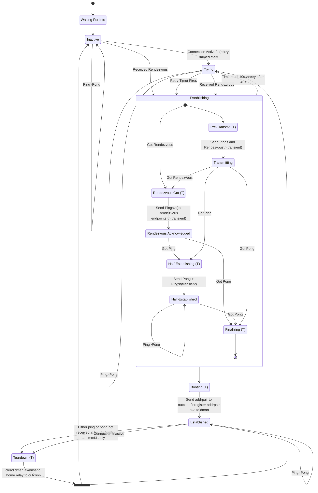
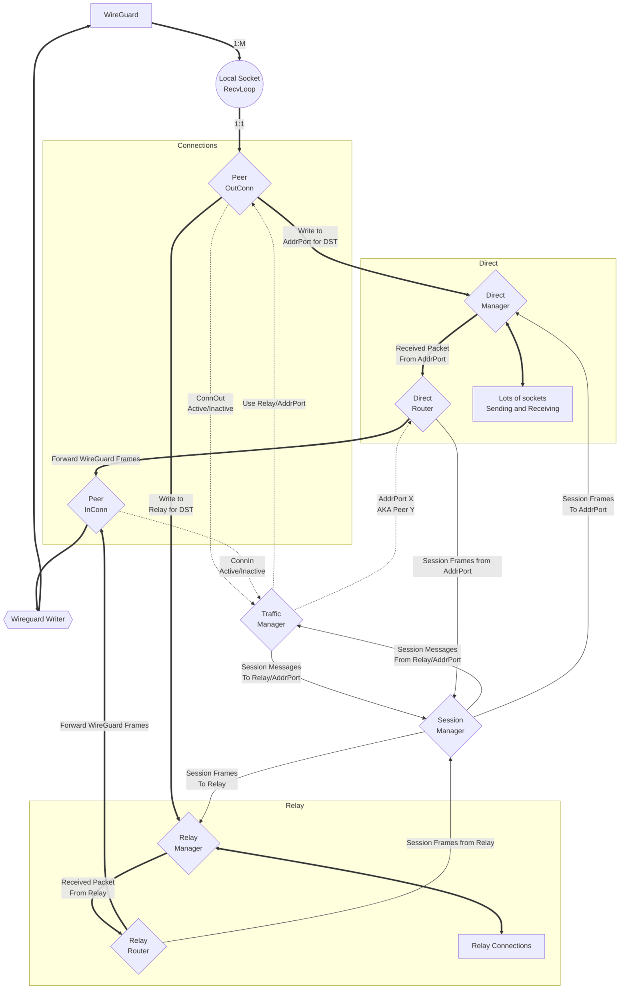

TMan (Traffic Manager) contains logic that will try to holepunch NATs periodically if it detects that a connection is being used.

The Mermaid State Diagram outlines this internal process.

The follow diagram outlines the interactions between different actors:

